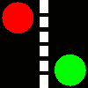
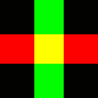

This toolbox reproduces the numerical illustrations of the paper:

Gabriel Peyré. [Entropic Approximation of Wasserstein Gradient Flows](http://arxiv.org/abs/1502.06216). SIAM Journal on Imaging Sciences, 8(4), pp. 2323–2351, 2015

Content
-------

The main scripts are:
* test_image.m: reproduces the figures of 2-D flows on a rectangular grid.
* test_mesh.m: reproduces the figures of flows on a triangulated mesh.
* test_prox_porous.m: display the proximal map of generalized entropies.
* test_barycenters.m: computation of Wasserstein barycenters (this is a simple example of use of perform_dikstra_scaling).
* test_pairwise_attraction: evolution of two densities connected by a Wasserstein distance
* test_pairwise_sum: evolution of two densities with a coupling on the sum
* test_wasserstein_attraction: minimization of a Wasserstein distance by Wasserstein flow.

The main functions are:
* perform_jko_stepping.m: perform the actual computation of a JKO step. It needs a callback to the Gibbs kernel.
* perform_dikstra_scaling.m: a generic solver for KL optimization problems.

Helpers functions:
* compute_geodesic_heat.m: compute approximate geodesic distances by the "geodesic in heat method".
* deconv_richlucy.m: linear deconvolution by Richardson-Lucy algorithm.
* load_porous_prox.m: implements the proximal operator of generalized entropies, computed using a look-up table.
* porous_prox_newton: same but implemented using a Newton scheme, useful to deal with spacially varying densities.
* load_setup.m: load various setup for the numerical experiments (i.e. metric, potential, initial densities, etc)
* load_kernel: load a Gibbs kernel.

Copyright
-------

Copyright (c) 2015 Gabriel Peyré
